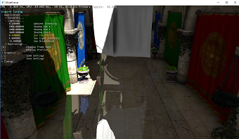

### Requirements
* GPU and driver with support for [DirectX 12 Ultimate](http://aka.ms/DirectX12UltimateDev)

### Getting Started
* DXR spec/documentation is available at [DirectX Specs site](https://microsoft.github.io/DirectX-Specs/d3d/Raytracing.html).

# Known issues
Depending on your Visual Studio version, some samples may fail to compile with these errors:
 * The system cannot find the path specified. *.hlsl.h
 * error MSB6006: "dxc.exe" exited with code 1.

Please see this GitHub issue for details on how to fix it: https://github.com/microsoft/DirectX-Graphics-Samples/issues/657

# Advanced Sample

## [MiniEngine Sample](src/ModelViewer/readme.md)
This sample demonstrates integration of the DirectX Raytracing in the MiniEngine's Model Viewer and several sample uses of raytracing.

